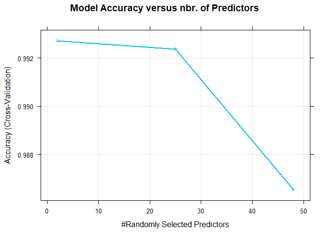
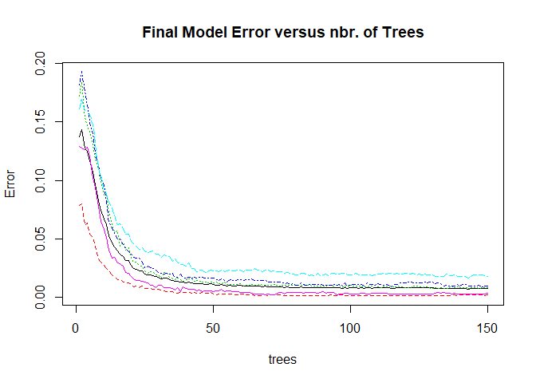
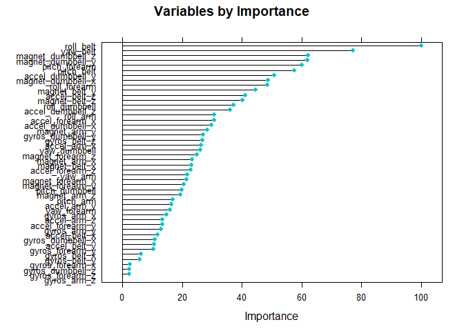
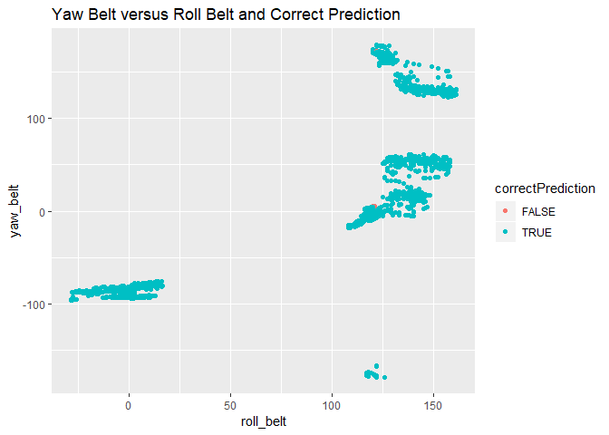

### Executive Summary
People regularly quantify how much of a particular physical activity they do, Using devices such as Jawbone Up, Nike FuelBand, and Fitbit. But rarely quantify how well they do it. 
In this project, we will use data from accelerometers on the belt, forearm, arm, and dumbell of 6 participants whom were asked to perform barbell lifts correctly and incorrectly in 5 different ways. Our goal is to predict the manner in which they did the exercise. This is the *classe* variable in the training set: 

*   A) performed correctly according to specification   
*   B) incorrectly throwing elbow to front  
*   C) incorrectly lifting the dumbbell only halfway  
*   D) incorrectly lowering the dumbbell only halfway   
*   E) incorrectly throwing the hips to the front  

For more information about dataset please visit [HAR website](http://groupware.les.inf.puc-rio.br/har) - section on the Weight Lifting Exercise Dataset.  

*   [Training data](https://d396qusza40orc.cloudfront.net/predmachlearn/pml-training.csv)   
*   [Test data](https://d396qusza40orc.cloudfront.net/predmachlearn/pml-testing.csv)  

### Data processing

**Read HAR data** for train and test data from working directory, folder "data".  


```r
# read train and test data, replacing both division error strings #DIV/0! and blank fields with NA values
trainData <- read.csv("./data/pml-training.csv",head=TRUE,sep=",",na.strings=c("NA","#DIV/0!",""))  
testData <- read.csv("./data/pml-testing.csv", head=TRUE, sep=",",na.strings=c("NA","#DIV/0!",""))    
```

Check **dimension** of datasets.


```r
data.frame("dataset" = c("train","test"), "numberOfRows" = c(dim(trainData)[1], dim(testData)[1]),
    "numberOfColumns" = c(dim(trainData)[2], dim(testData)[2])) %>%
    kable() %>%
    kable_styling(bootstrap_options = "striped", full_width = F, position = "left")
```

<table class="table table-striped" style="width: auto !important; ">
 <thead>
  <tr>
   <th style="text-align:left;"> dataset </th>
   <th style="text-align:right;"> numberOfRows </th>
   <th style="text-align:right;"> numberOfColumns </th>
  </tr>
 </thead>
<tbody>
  <tr>
   <td style="text-align:left;"> train </td>
   <td style="text-align:right;"> 19622 </td>
   <td style="text-align:right;"> 160 </td>
  </tr>
  <tr>
   <td style="text-align:left;"> test </td>
   <td style="text-align:right;"> 20 </td>
   <td style="text-align:right;"> 160 </td>
  </tr>
</tbody>
</table>

Verify if there are **missing values** in the dataset columns and **percentage** to total, since the prediction algorithm will fail to work properly with missing values. Find the columns that have more than **95%** missing values, as applicable.


```r
naTrain <- sapply(trainData, function(x) {sum(is.na(x)==TRUE)/length(x)})
naTest <- sapply(testData, function(x) {sum(is.na(x)==TRUE)/length(x)})
data.frame ("trainColNa95Perc" = sum(naTrain > .95), "testColNa95Perc"= sum(naTest > .95)) %>%
    kable() %>%
    kable_styling(bootstrap_options = "striped", full_width = F, position = "left")
```

<table class="table table-striped" style="width: auto !important; ">
 <thead>
  <tr>
   <th style="text-align:right;"> trainColNa95Perc </th>
   <th style="text-align:right;"> testColNa95Perc </th>
  </tr>
 </thead>
<tbody>
  <tr>
   <td style="text-align:right;"> 100 </td>
   <td style="text-align:right;"> 100 </td>
  </tr>
</tbody>
</table>

Remove those **100 columns that have over 95% NA** (missing values).


```r
trainData2 <- trainData[, names(which(naTrain<=.95))]
testData2 <- testData[, names(which(naTest<=.95))]
```

Remove **zero covariates** (predictors that do not contribute much in prediction, for having very little variability in them).  


```r
nsvTrain <- nearZeroVar(trainData2,saveMetrics=TRUE)
nsvTest <- nearZeroVar(testData2,saveMetrics=TRUE)
trainData3 <- trainData2[,which(nsvTrain$nzv==FALSE)]
testData3 <- testData2[,which(nsvTest$nzv==FALSE)]
```

Verify if **any other variable** should also be removed.  


```r
str(trainData3); str(testData3)
```

Choose to only keep predictors related to the **basic original measurement of movement** on belt, glove, arm-band or dumbell. Will not include in the model variables related to unique identifiers, time series, or calculations such as total.


```r
trainData4 <- trainData3[, which(grepl("_x|_y|_z|^yaw|^pitch|^roll|classe", names(trainData3)))]
testData4 <- testData3[, which(grepl("_x|_y|_z|^yaw|^pitch|^roll|classe", names(testData3)))]
```

### Building the model

Take a look at **"classe"** levels (this variable predicts the manner in which exercise was performed) to confirm values.  


```r
table(trainData4$classe) %>%
    kable() %>%
    kable_styling(bootstrap_options = "striped", full_width = F, position = "left")
```

<table class="table table-striped" style="width: auto !important; ">
 <thead>
  <tr>
   <th style="text-align:left;"> Var1 </th>
   <th style="text-align:right;"> Freq </th>
  </tr>
 </thead>
<tbody>
  <tr>
   <td style="text-align:left;"> A </td>
   <td style="text-align:right;"> 5580 </td>
  </tr>
  <tr>
   <td style="text-align:left;"> B </td>
   <td style="text-align:right;"> 3797 </td>
  </tr>
  <tr>
   <td style="text-align:left;"> C </td>
   <td style="text-align:right;"> 3422 </td>
  </tr>
  <tr>
   <td style="text-align:left;"> D </td>
   <td style="text-align:right;"> 3216 </td>
  </tr>
  <tr>
   <td style="text-align:left;"> E </td>
   <td style="text-align:right;"> 3607 </td>
  </tr>
</tbody>
</table>

**Split** the train data into 70% training and 30% validation test on column class for building/ validating the model.


```r
set.seed(24642)
inTrain <- createDataPartition (trainData4$classe, p=0.7, list=FALSE)
training <- trainData4 [inTrain ,]
validating <- trainData4 [- inTrain,]
```

Since this is a **classification** prediction type and there is a **large number of variables** as predictors, we chose the **random forest** method for modeling. Random Forest grows many trees (or a forest), through bootstrap sampling (sampling with replacement). At each node, a subset of predictors m, is selected at random out of M total predictors. The best split on these m is used to split the node. And m is held constant as the forest grows. Also random forest handles well outliers and correlated variables.  


```r
# Random forest with 10 folds cross validation and 150 trees
rFFit <- train(classe ~ ., data = training, method = "rf",  
    trControl = trainControl(method = "cv", number=10),
             allowParallel=TRUE, ntree=150)
print(rFFit)
```

```
## Random Forest 
## 
## 13737 samples
##    48 predictor
##     5 classes: 'A', 'B', 'C', 'D', 'E' 
## 
## No pre-processing
## Resampling: Cross-Validated (10 fold) 
## Summary of sample sizes: 12363, 12363, 12364, 12363, 12364, 12363, ... 
## Resampling results across tuning parameters:
## 
##   mtry  Accuracy   Kappa    
##    2    0.9927199  0.9907901
##   25    0.9923568  0.9903314
##   48    0.9865339  0.9829647
## 
## Accuracy was used to select the optimal model using the largest value.
## The final value used for the model was mtry = 2.
```

**Cross-validation** was performed inside the model so a separate test set to obtain the unbiased estimate of the test set error is not really necessary. And the **error rate** is expected to be low, due to model selected.

### Visualizing the model


```r
plot(rFFit, col = "turquoise3", lwd = 2, main = "Model Accuracy versus nbr. of Predictors")
```

<!-- -->

```r
plot(rFFit$finalModel, main = "Final Model Error versus nbr. of Trees")
```

<!-- -->

```r
plot(varImp(rFFit), col = "turquoise3", main = "Variables by Importance")
```

<!-- -->

Notice on above charts:   

*   The highest accuracy was obtained with only 2 randomly selected predictors  
*   50 trees would be sufficient for this study  
*   Top 2 most important variables are: roll-belt and yaw-belt  

### Validating the model

Evaluate the fitted model, using it to predict classe in validation data set. Compute the confusion matrix and associated statistics to asses the preformance of the model fit.  


```r
predictrFFit <- predict(rFFit, newdata = validating)
confusionMatrix(data = predictrFFit, validating$classe)
```

```
## Confusion Matrix and Statistics
## 
##           Reference
## Prediction    A    B    C    D    E
##          A 1674   11    0    0    0
##          B    0 1121    5    0    0
##          C    0    5 1021   19    0
##          D    0    2    0  945    1
##          E    0    0    0    0 1081
## 
## Overall Statistics
##                                           
##                Accuracy : 0.9927          
##                  95% CI : (0.9902, 0.9947)
##     No Information Rate : 0.2845          
##     P-Value [Acc > NIR] : < 2.2e-16       
##                                           
##                   Kappa : 0.9908          
##  Mcnemar's Test P-Value : NA              
## 
## Statistics by Class:
## 
##                      Class: A Class: B Class: C Class: D Class: E
## Sensitivity            1.0000   0.9842   0.9951   0.9803   0.9991
## Specificity            0.9974   0.9989   0.9951   0.9994   1.0000
## Pos Pred Value         0.9935   0.9956   0.9770   0.9968   1.0000
## Neg Pred Value         1.0000   0.9962   0.9990   0.9962   0.9998
## Prevalence             0.2845   0.1935   0.1743   0.1638   0.1839
## Detection Rate         0.2845   0.1905   0.1735   0.1606   0.1837
## Detection Prevalence   0.2863   0.1913   0.1776   0.1611   0.1837
## Balanced Accuracy      0.9987   0.9916   0.9951   0.9898   0.9995
```

The **Accuracy** of our model seems very good, at **99.3%**.  Predictions look reliable.  
We now plot top 2 variables for a simple visualization of prediction.  


```r
correctPrediction <- predictrFFit == validating$classe
qplot(roll_belt, yaw_belt, data=validating, colour=correctPrediction, main = "Yaw Belt versus Roll Belt and Correct Prediction") 
```

<!-- -->

### Applying final model to test dataset


```r
finalPrediction <- predict(rFFit, testData4)
data.frame("case nbr"=c(1:20),"class prediction" = finalPrediction) %>%
    kable() %>%
    kable_styling(bootstrap_options = "striped", full_width = F, position = "left")
```

<table class="table table-striped" style="width: auto !important; ">
 <thead>
  <tr>
   <th style="text-align:right;"> case.nbr </th>
   <th style="text-align:left;"> class.prediction </th>
  </tr>
 </thead>
<tbody>
  <tr>
   <td style="text-align:right;"> 1 </td>
   <td style="text-align:left;"> B </td>
  </tr>
  <tr>
   <td style="text-align:right;"> 2 </td>
   <td style="text-align:left;"> A </td>
  </tr>
  <tr>
   <td style="text-align:right;"> 3 </td>
   <td style="text-align:left;"> B </td>
  </tr>
  <tr>
   <td style="text-align:right;"> 4 </td>
   <td style="text-align:left;"> A </td>
  </tr>
  <tr>
   <td style="text-align:right;"> 5 </td>
   <td style="text-align:left;"> A </td>
  </tr>
  <tr>
   <td style="text-align:right;"> 6 </td>
   <td style="text-align:left;"> E </td>
  </tr>
  <tr>
   <td style="text-align:right;"> 7 </td>
   <td style="text-align:left;"> D </td>
  </tr>
  <tr>
   <td style="text-align:right;"> 8 </td>
   <td style="text-align:left;"> B </td>
  </tr>
  <tr>
   <td style="text-align:right;"> 9 </td>
   <td style="text-align:left;"> A </td>
  </tr>
  <tr>
   <td style="text-align:right;"> 10 </td>
   <td style="text-align:left;"> A </td>
  </tr>
  <tr>
   <td style="text-align:right;"> 11 </td>
   <td style="text-align:left;"> B </td>
  </tr>
  <tr>
   <td style="text-align:right;"> 12 </td>
   <td style="text-align:left;"> C </td>
  </tr>
  <tr>
   <td style="text-align:right;"> 13 </td>
   <td style="text-align:left;"> B </td>
  </tr>
  <tr>
   <td style="text-align:right;"> 14 </td>
   <td style="text-align:left;"> A </td>
  </tr>
  <tr>
   <td style="text-align:right;"> 15 </td>
   <td style="text-align:left;"> E </td>
  </tr>
  <tr>
   <td style="text-align:right;"> 16 </td>
   <td style="text-align:left;"> E </td>
  </tr>
  <tr>
   <td style="text-align:right;"> 17 </td>
   <td style="text-align:left;"> A </td>
  </tr>
  <tr>
   <td style="text-align:right;"> 18 </td>
   <td style="text-align:left;"> B </td>
  </tr>
  <tr>
   <td style="text-align:right;"> 19 </td>
   <td style="text-align:left;"> B </td>
  </tr>
  <tr>
   <td style="text-align:right;"> 20 </td>
   <td style="text-align:left;"> B </td>
  </tr>
</tbody>
</table>

### Conclusions

Considering the high accuracy obtained from our model, it appears very reasonable to predict the manner in which people exercise. Sensitivity of classe A prediction is 100%. Using wearable devices or sensors to collect data and providing real-time feedback to users on how well they are performing the exercise would highly enhance work-out technique. 
